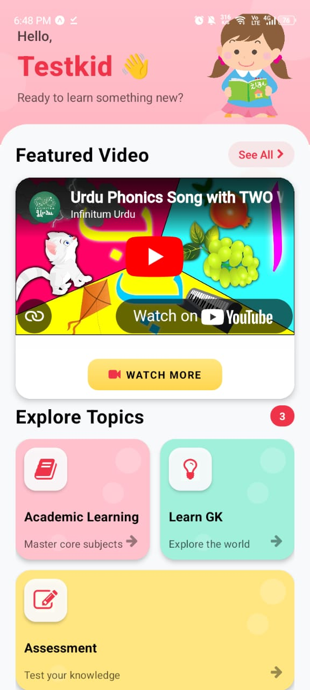
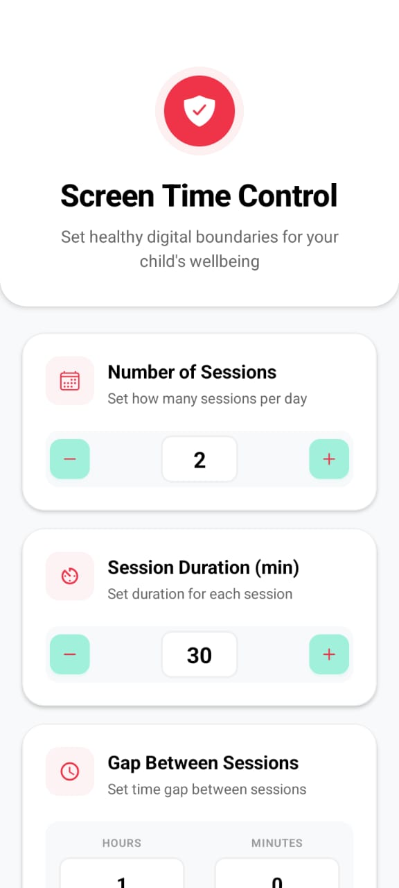
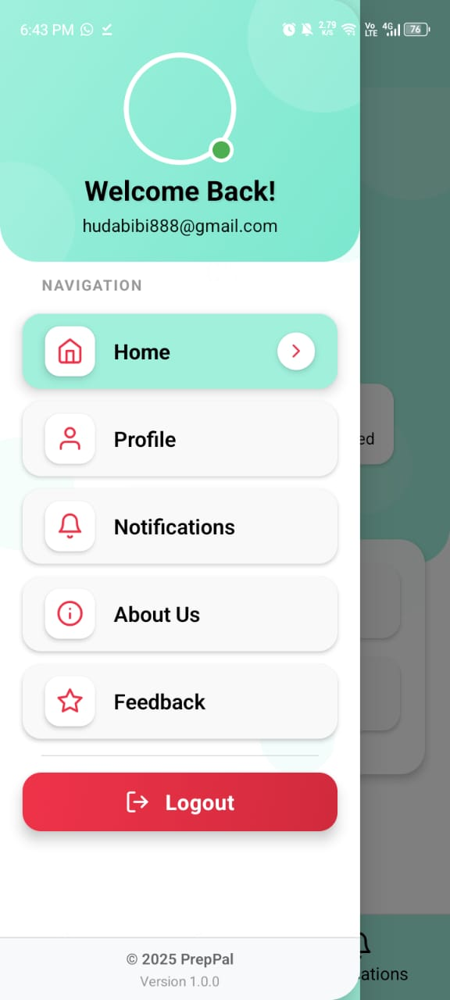

# PrepPal - Pre-School Learning App 📚✨



**PrepPal** is an interactive mobile and web application designed to make learning fun and engaging for preschool kids aged 2–5. The platform provides educational content, interactive quizzes, voice recognition-based learning, and comprehensive progress tracking, empowering parents to actively guide their children's learning journey.

---

## 🎯 Overview

PrepPal is a comprehensive educational ecosystem that combines:
- **Mobile Application** - Interactive learning platform for kids
- **Parent Dashboard** - Progress monitoring and content management
- **Admin Portal** - System-wide content and user management

The application focuses on early childhood education, covering foundational concepts in multiple languages and subject areas, with an emphasis on interactive, voice-enabled learning experiences.

---

## ✨ Key Features

### 👶 For Kids

- **Language Learning**
  - Urdu alphabets with pronunciation guides
  - English letters and phonics
  - Number recognition and counting (1-10)
  
- **Core Concepts**
  - Body parts identification
  - Shapes and colors recognition
  - Fruits and vegetables
  - Vowels and basic phonetics
  
- **Interactive Learning**
  - AI-generated quizzes for practice
  - Voice recognition for pronunciation improvement
  - Counting activities with visual aids
  - Gamified learning experience
  
- **Rewards System**
  - Achievement badges for quiz completion
  - Progress-based rewards
  - Motivational feedback

---

### 👨‍👩‍👧 For Parents

- **Profile Management**
  - Create and manage kid profiles
  - Customize learning paths
  - Set age-appropriate content
  
- **Learning Control**
  - Select specific courses/subjects to focus on
  - Manage daily learning activities
  - Set screen time limits
  
- **Progress Tracking**
  - Monitor learning progress in real-time
  - View quiz results and performance metrics
  - Track time spent on each activity
  - Generate progress reports

---

### 🔧 Admin Panel

- **Content Management**
  - Add, update, and delete learning materials
  - Create and manage quizzes
  - Organize course materials by category
  
- **System Monitoring**
  - Monitor parent and kid activity
  - Track system usage and engagement
  - Manage user accounts
  
- **Reward Administration**
  - Configure reward criteria
  - Manage achievement system
  - Track reward distribution

---

## 📸 Screenshots

### Application Interface



*Mobile app interface showcasing interactive learning modules and kid-friendly design*

---



*Quiz interface and progress tracking features*

---

## 🛠️ Tech Stack

### Frontend

**Mobile Application**
- **React Native** with Expo - Cross-platform mobile development
- **React Navigation** - Seamless navigation experience
- **Expo Speech** - Voice recognition and text-to-speech
- **Font Awesome & Heroicons** - Icon library
- **Axios** - HTTP client for API requests

**Admin Panel**
- **React.js** - Modern web interface
- **React Router** - Client-side routing
- **Axios** - API integration

### Backend

- **Node.js** - JavaScript runtime
- **Express.js** - Web application framework
- **MongoDB** - NoSQL database
- **Mongoose** - MongoDB object modeling
- **JWT (JSON Web Tokens)** - Secure authentication
- **BcryptJS** - Password hashing and security
- **Google Sign-In API** - OAuth integration for verification

### Development Tools

- **VS Code** - Primary IDE
- **Expo CLI** - React Native development toolkit
- **Git & GitHub** - Version control
- **Postman** - API testing
- **MongoDB Compass** - Database management
- **Microsoft Teams / Jira** - Project management and collaboration

---

## 📁 Project Architecture

```
PrepPal/
├── mobile-app/              # React Native mobile application
│   ├── components/          # Reusable UI components
│   ├── screens/             # App screens and views
│   ├── navigation/          # Navigation configuration
│   ├── services/            # API service layers
│   └── utils/               # Utility functions
│
├── admin-panel/             # React.js admin dashboard
│   ├── components/          # Admin UI components
│   ├── pages/               # Admin pages
│   └── services/            # API integration
│
├── backend/                 # Node.js/Express server
│   ├── models/              # Mongoose schemas
│   ├── controllers/         # Business logic
│   ├── routes/              # API endpoints
│   ├── middleware/          # Authentication & validation
│   └── config/              # Configuration files
│
└── docs/                    # Documentation
```

---

## 🚀 Setup Instructions

### Prerequisites

Before you begin, ensure you have the following installed:
- **Node.js** (v14 or higher)
- **npm** or **yarn**
- **MongoDB** (local or cloud instance)
- **Expo CLI** (`npm install -g expo-cli`)
- **Git**

### Installation Steps

1. **Clone the Repository**
   ```bash
   git clone https://github.com/s1hb888/PrepPal_Fyp.git
   cd PrepPal_Fyp
   ```

2. **Install Backend Dependencies**
   ```bash
   cd backend
   npm install
   ```

3. **Install Mobile App Dependencies**
   ```bash
   cd ../mobile-app
   npm install
   ```

4. **Install Admin Panel Dependencies**
   ```bash
   cd ../admin-panel
   npm install
   ```

5. **Configure Environment Variables**
   
   Create `.env` file in the backend directory:
   ```env
   PORT=5000
   MONGODB_URI=your_mongodb_connection_string
   JWT_SECRET=your_jwt_secret_key
   GOOGLE_CLIENT_ID=your_google_client_id
   ```

6. **Start MongoDB**
   ```bash
   # If running locally
   mongod
   ```

---

## 🎮 Running the Application

### Start Backend Server

```bash
cd backend
npm start
# Server will run on http://localhost:5000
```

### Start Mobile App

```bash
cd mobile-app
expo start
# Scan QR code with Expo Go app on your phone
```

### Start Admin Panel

```bash
cd admin-panel
npm start
# Admin panel will run on http://localhost:3000
```

---

## 📊 Key Functionalities

### Authentication System
- Secure user registration and login
- JWT-based session management
- Google Sign-In integration
- Password encryption with bcrypt

### Learning Modules
- Categorized content by subject and difficulty
- Progressive learning paths
- Interactive multimedia content
- Voice-enabled exercises

### Quiz System
- Multiple-choice questions
- Voice recognition quizzes
- AI-generated quiz content
- Instant feedback and scoring
- Performance analytics

### Progress Tracking
- Real-time learning metrics
- Historical performance data
- Visual progress indicators
- Exportable reports for parents

---

## 🎓 Final Year Project Context

PrepPal was developed as a **Final Year Project (FYP)** in Software Engineering, demonstrating:

- **Full-Stack Development** - Mobile, web, and backend integration
- **User-Centered Design** - Age-appropriate interface for kids and intuitive parent controls
- **Educational Technology** - Application of learning theories in digital format
- **Voice AI Integration** - Speech recognition for enhanced learning
- **Database Design** - Scalable data architecture for educational content
- **Security Implementation** - Secure authentication and data protection

---

## 👩‍💻 Project Details

**Developer:** Hudda Bibi  
**Project Type:** Final Year Project (FYP)  
**Discipline:** Software Engineering  
**Target Age Group:** 2-5 years  
**Languages Supported:** English, Urdu  

---

## 🔗 Related Repository

- **PrepPal Admin Portal:** [https://github.com/s1hb888/admin-portal](https://github.com/s1hb888/admin-portal)

---

## 🤝 Contributing

Contributions are welcome! If you'd like to contribute to PrepPal:

1. Fork the repository
2. Create a feature branch (`git checkout -b feature/AmazingFeature`)
3. Commit your changes (`git commit -m 'Add some AmazingFeature'`)
4. Push to the branch (`git push origin feature/AmazingFeature`)
5. Open a Pull Request

---

## 📝 License

This project was developed for academic purposes as part of a Final Year Project.

---

## 📧 Contact

For questions, feedback, or collaboration opportunities:

- **Email:** hudabibi888@gmail.com
- **GitHub:** [@s1hb888](https://github.com/s1hb888)
- **LinkedIn:** [Hudda Bibi](https://www.linkedin.com/in/hudda-bibi/)

---

<div align="center">

**Built with ❤️ for early childhood education**

*Empowering the next generation through interactive learning*

</div>
